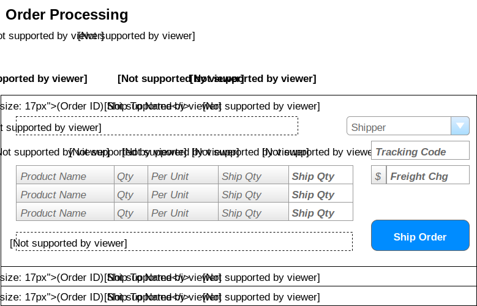
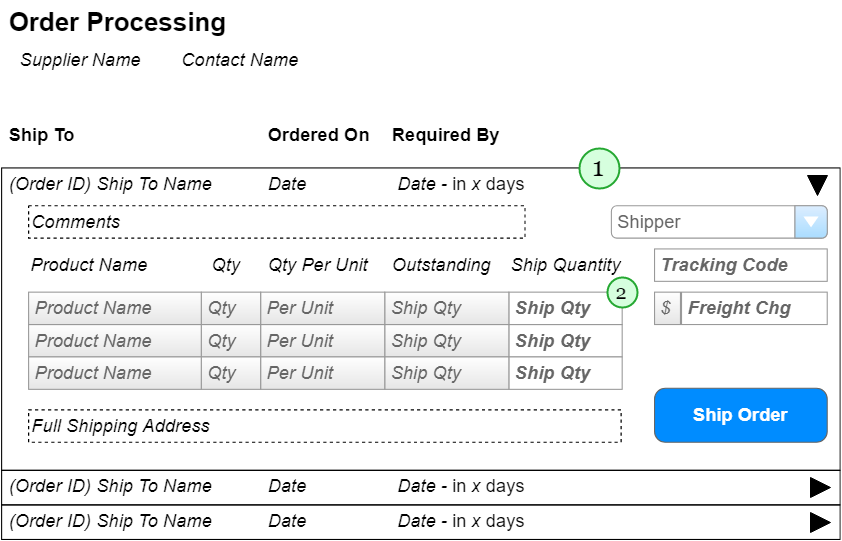

# Order Processing - Implementation Plan

> Orders are shipped direcctly from our suppliers to our customers. As such, suppliers log onto our system to see what orders there are for the products they provide.

## User Interface

Suppliers will be interacting with a page that shows the following information.



## Implementation 

The form will primarily use a `<asp:ListView>` to represent the orders **(1)** and show the order items **(2)** in a `<asp:GridView>` inside of the ListView's `<SelectedItemTemplate>`. The controls i will use include:

1. ListView - for the orders
2. GridView - for the products on the order
3. DropDownList - for the Shipper

remaining items are simple: textboxes/labels/buttons.



### Queries/Presentation

#### Data Models

```csharp
public class SupplierSummary
{
    public int SupplierID { get; set; }
    public string Company { get; set; }
    public string ContactName { get; set; }
}
```

```csharp
public class ShipperSelection
{
    public int ShipperID { get; set; }
    public string Name { get; set; }
}
```

```csharp
public class ProductSummary
{
    public int ProductID { get; set; }
    public string ProductName { get; set; }
    public short Quantity { get; set; }
    public string QtyPerUnit { get; set; }
    public int OutstandingQty { get; set; }
}
```

```csharp
public class OutstandingOrder
{
    public int OrderID { get; set; }
    public string ShipToName { get; set; }
    public DateTime OrderedDate { get; set; }
    public DateTime RequiredDate { get; set; }
    public int DaysToDelivery { get; }
    public List<ProductSummary> OutstandingItems { get; set; }
    public string Comments { get; set; }
    public string FullShippingAddress { get; set;}
}
```

#### Presentation Layer

- **Databound Controls**
  - **ListViewDataSource** - Provide data for the ListView of orders; Call `List<OutstandingOrder> OrderProcessingController.LoadOrders(int supplierID)` 
  - **GridViewDataSource** - Provide data for the DropDown of Shippers; Call `List<ShipperSelection> OrderProcessingController.ListShippers()` 
  - **Page_Load** event - Display the supplier's summary information; Call `SupplierSummary OrderProcessingController.GetSupplier(int supplierID)` 
  - **ListView** - Use the `<SelectedItemTemplate>` to display the order's details, including the `<GridView>` of products on the order.

#### BLL Processing

The BLL will have a single class called `OrderProcessingController` which will ahve the following methods for querying:

- `List<OutstandingOrder> LoadOrders(int supplierID)` - Query the **Customers**,**Orders**, **OrderDetails**, and **Products** tables for data on products that come from the `supplierID`.
- `List<ShipperSelection> ListShippers()` - Query the **Shippers** table.
- `SupplierSummary GetSupplier(int supplierID)` - Query the **Suppliers** table.

### Commands/Processing

#### Data Models

```csharp
public class ProductShipment
{
    public int ProductID { get; set; }
    public short Quantity { get; set; }
}
```

```csharp
public class ShippingDirections
{
    public int ShipperID { get; set; }
    public string TrackingCode { get; set; }
    public decimal? FreightCharge { get; set; }
}
```

#### Presentation Layer

- **ShipOrder_Click** - Gather information from the form to send to the BLL using the `void OrderProcessingController.ShipOrder(int orderID, ShippingDirections directions, List<ProductShipment> items)`.

#### BLL Processing
- `void ShipOrder(int orderID, ShippingDirections directions, List<ProductShipment> items)`
  - Validation of input:
    - OrderID must exist
    - Shipper must exist
    - Must have one or more items to ship
    - ProductIDs must exist and be valid
    - Quantities must be greater than 0 and less than the number/qty outstanding on the order
    - Freight cahrge is either null or a value greater than 0
  - **Add** a new `Shipment` to the database
  - **Add** new `ManifestItem` objects to the new shipment 